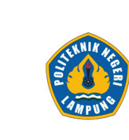

# **TPD - TUGAS PRAKTIK DEMONSTRASI**
## **Website sekolah (SMAN 1 HARAPAN BANGSA)**

<br>

### **Oleh**

### **Zakkya Nur Hadi**
#### **NPM 23753041**

<br>



<br>

### **POLITEKNIK NEGERI LAMPUNG**
### **BANDAR LAMPUNG**
### **2026**

---

<div style="page-break-before: always;"></div>

_Junior Web Developer — LSP Entrepreneur Digital Indonesia_ 

# **LAPORAN TUGAS PRAKTIK DEMONSTRASI (FR.IA.02)** 

**SKEMA SERTIFIKASI JUNIOR WEB DEVELOPER** 

###### **JUDUL PROYEK** 

### **PENGEMBANGAN SISTEM INFORMASI PORTAL PROFIL SEKOLAH BERBASIS WEB (SMA NEGERI 1 HARAPAN BANGSA)** 

**Skema Sertifikasi** : **Junior Web Developer**  
**Nomor Skema** : **02/SKM/DID/VII/2024**  
**Tempat Uji Kompetensi** : **Politeknik Negeri Lampung (POLINELA), Bandar Lampung**  
**Lembaga Sertifikasi** : **LSP Entrepreneur Digital Indonesia**  
**Waktu Pelaksanaan** : **3 Jam**  
**Tanggal Uji** : **14 September 2026**  

### **IDENTITAS ASESI**
- **Nama Lengkap** : **Zakkya Nur Hadi**  
- **NPM** : **23753041**  
- **Surel (Email)** : **zakkya.nurhadi@gmail.com**  
- **Tautan Repositori** : **https://github.com/zakkyanurhadi/BNSP-web-Sekolah**  

### **IDENTITAS ASESOR**
- **Nama Asesor** : **Yosep Kurniawan, ST**  
- **Nomor Registrasi** : **No. Reg 000.002992.2021**  

_KETERANGAN DATA: Seluruh entitas dan data informasi sekolah pada dokumen ini dirancang dan diinisialisasi khusus sebagai media demonstrasi uji kompetensi menggunakan basis data relasional PostgreSQL serta Database Seeder._ 

---

_Junior Web Developer — LSP Entrepreneur Digital Indonesia_ 

## **DAFTAR ISI LAPORAN** 

##### **1. RINGKASAN EKSEKUTIF DAN GAMBARAN UMUM APLIKASI** 

- 1.1 Latar Belakang & Deskripsi Portal Sekolah 

- 1.2 Karakteristik & Arsitektur Utama Aplikasi 

- 1.3 Matriks Ringkasan Parameter Teknis 

##### **2. MATRIKS PEMENUHAN SKENARIO SOAL (FR.IA.02)** 

2.1 – 2.5 Pemenuhan Ketentuan Soal No. 1 s.d. No. 5 

##### **3. SPESIFIKASI LINGKUNGAN PENGEMBANGAN & TEKNOLOGI** 

3.1 Perangkat Lunak dan Alat Bantu Pengembangan (Tools) 

3.2 Bahasa Pemrograman & Library Pendukung 

3.3 Struktur Basis Data Relasional PostgreSQL (9 Entitas Pokok) 

3.4 Inventaris Dokumen Kode Program yang Dibangun 

##### **4. PENERAPAN UNIT KOMPETENSI BNSP** 

4.1 – 4.6 Unit J.620100.015.01 s.d. Verifikasi Kualitas Perangkat Lunak 

##### **5. CATATAN DEBUGGING DAN PENYELESAIAN KENDALA TEKNIS** 

5.1 Log Identifikasi Kendala, Penyebab, dan Tindakan Solutif 

5.2 Mekanisme Antisipasi Galat (Error Handling) 

##### **6. PETUNJUK INSTALASI DAN PENGOPERASIAN SISTEM** 

6.1 Prasyarat Lingkungan Server Lokal 

- 6.2 Panduan Deployment Bertahap 

- 6.3 Akses Portal Publik dan Panel Administrator CMS 

##### **7. DOKUMENTASI VISUAL ANTARMUKA SISTEM (SCREENSHOT)** 

##### **8. LAMPIRAN POTONGAN KODE SUMBER (SOURCE CODE EVIDENCE)** 

##### **9. KESIMPULAN DAN PENUTUP** 

Halaman 2 

_Junior Web Developer — LSP Entrepreneur Digital Indonesia_ 

## **1. RINGKASAN EKSEKUTIF DAN GAMBARAN UMUM APLIKASI** 

#### **1.1 Latar Belakang & Deskripsi Portal Sekolah** 

Perkembangan teknologi informasi menuntut institusi pendidikan untuk memiliki media publikasi resmi yang kredibel, transparan, dan mudah diakses oleh masyarakat umum, peserta didik, serta orang tua/wali siswa. Website Sekolah SMA Negeri 1 Harapan Bangsa dirancang dan dikembangkan sebagai portal informasi digital terpadu yang merepresentasikan keunggulan akademik, sarana prasarana, program pembinaan kesiswaan, serta identitas kelembagaan sekolah secara profesional. 

Situs ini menghadirkan pengalaman penjelajahan yang responsif, modern, dan informatif. Melalui portal ini, pengunjung dapat meninjau visi, misi, sejarah, dan struktur kepemimpinan sekolah; memantau data pokok guru dan siswa secara riil; membaca warta kegiatan serta pengumuman prestasi terkini; menelusuri dokumentasi foto kegiatan; mengakses pengumuman pendaftaran peserta didik baru (PPDB); serta menghubungi pihak sekolah melalui formulir kontak terintegrasi. 

#### **1.2 Karakteristik & Arsitektur Utama Aplikasi** 

Aplikasi ini dikembangkan tidak sekadar sebagai situs statis sederhana, melainkan sebagai aplikasi web dinamis berkekuatan penuh yang dibangun di atas arsitektur Model-View-Controller (MVC) menggunakan fondasi framework Laravel 12.x. 

Karakteristik teknis utama dari sistem ini mencakup: 

1. Pemisahan Logika dan Tampilan: Alur data dikendalikan secara rapi oleh Controller, model data dikelola oleh Eloquent ORM dengan database PostgreSQL, dan antarmuka disajikan melalui  ctual templating modular Blade. 

2. Desain Berbasis Utilitas Modern: Seluruh komponen visual dirancang menggunakan Tailwind CSS 4 yang teroptimasi secara langsung melalui Vite, menghasilkan tampilan antarmuka yang elegan, konsisten, dan ringan. 

3. Reaktivitas Klien Ringkas: Interaktivitas dinamis (seperti drawer menu mobile dan modal lightbox galeri foto) dibangun menggunakan Alpine.js tanpa memerlukan ketergantungan framework frontend berukuran besar (SPA). 

4. Content Management System (CMS) Terintegrasi: Sistem dilengkapi dengan Panel Administrator modern berbasis Filament 3 pada rute /admin, memberikan staf pengelola sekolah kemudahan penuh untuk melakukan operasi CRUD (Create, Read, Update, Delete) terhadap artikel berita, kategori, galeri, fasilitas, ekstrakurikuler, profil, dan kotak masuk  ctual r kontak tanpa menyentuh kode program. 

#### **1.3 Matriks Ringkasan Parameter Teknis** 

|**Kategori Parameter**|**Keterangan / Nilai Implementasi**|
|---|---|
|Framework Aplikasi Utama|Laravel 12.x (Arsitektur Model-View-Controller)|
|Framework Panel Admin|Filament 3.x (TALL Stack: Tailwind, Alpine, Laravel, Livewire)|
|Sistem Manajemen Basis Data|PostgreSQL 16+ (Nama Basis Data: website_sekolah)|


Halaman 3 

_Junior Web Developer — LSP Entrepreneur Digital Indonesia_ 

|**Kategori Parameter**|**Keterangan / Nilai Implementasi**|
|---|---|
|Kerangka Tampilan (CSS)|Tailwind CSS 4.x via @tailwindcss/vite|
|Library Interaktivitas Klien|Alpine.js 3.x|
|Library Ikon Grafis|Heroicons 2.x (Blade SVG Components)|
|Lingkungan Eksekusi Server|PHP 8.2+ dengan Ekstensi PDO, cURL, OpenSSL, Mbstring|
|Jumlah Rute Publik Aktif|6 Rute Halaman Pokok + 1 Endpoint Peta Situs XML (sitemap.xml)|
|Jumlah Panel Resource Admin|8 Resource Manajemen Data Dinamis|
|Jumlah Entitas Model Data|9 Model Eloquent (Relasi One-to-Many & Mass Assignment Guard)|
|Jumlah Komponen Blade|15 Berkas Tampilan (Layout Induk, Komponen Reusable, Halaman)|
|Jaminan Uji Mutu Otomatis|12 Feature Test Cases Lulus 100% (PHPUnit 11)|


Halaman 4 

_Junior Web Developer — LSP Entrepreneur Digital Indonesia_ 

## **2. MATRIKS PEMENUHAN SKENARIO SOAL (FR.IA.02)** 

Berdasarkan  ctual r instruksi Tugas Praktik Demonstrasi FR.IA.02 Skema Sertifikasi Junior Web Developer, seluruh instruksi kerja telah diimplementasikan secara komprehensif pada aplikasi web SMA Negeri 1 Harapan Bangsa. Tabel berikut merangkum korelasi antara butir ketentuan soal dan bukti teknis pemenuhannya pada kode program: 

|**No**|**Ketentuan Skenario Soal**|**Bukti Teknis Implementasi**|**Lokasi Berkas Sumber**|
|---|---|---|---|
|**1**|Website sekolah dengan user<br>interface yang interaktif pada<br>menu-menu di halaman<br>utama|Bilah navigasi (navbar)<br>mengadopsi mekanisme<br>interaktif: mendeteksi posisi<br>gulir jendela peramban<br>untuk mengaktifkan transisi<br>latar belakang (scrolled<br>state), memberikan<br>indikator visual rute aktif<br>secara kontekstual, serta<br>menyediakan menu drawer<br>hamburger responsif<br>berbasis Alpine.js untuk<br>layar ponsel.|Resources/views/components/navbar.blade.php|
|**2**|Pada halaman utama terdapat<br>menu utama seperti Beranda,<br>Profil Sekolah,<br>Ekstrakurikuler/Fasilitas,<br>Galeri, dll.|Struktur menu utama<br>didefinisikan secara terpusat<br>pada komponen navigasi:<br>Beranda, Profil, Berita,<br>Galeri, dan Kontak,<br>ditambah tombol<br>pendaftaran PPDB Online.<br>Menu konsisten tersedia<br>pada mode desktop maupun<br>seluler.|Resources/views/components/navbar.blade.php<br>routes/web.php|
|**3**|Pada halaman utama terdapat<br>berita kegiatan sekolah, galeri<br>dan informasi jumlah guru dan<br>siswa|Halaman beranda (Home)<br>memuat: Tiga artikel berita<br>terkini lengkap dengan<br>kategori & tanggal rilis;<br>enam dokumentasi foto<br>kegiatan sekolah; serta kartu<br>statistik data pokok<br>pendidikan: 42 Guru, 780<br>Siswa (360 Putra, 420 Putri),<br>24 Rombel, dan 16 Tenaga<br>Kependidikan.|Resources/views/pages/home.blade.php<br>resources/views/components/news-<br>card.blade.php<br>resources/views/components/gallery-<br>card.blade.php|
|**4**|Setiap Menu utama memiliki<br>halaman tersendiri|Setiap menu navigasi<br>dipetakan ke rute web unik<br>pada routes/web.php yang<br>memanggil metode<br>controller khusus dan<br>merender berkas tampilan<br>Blade tersendiri (home,<br>profile, news.index,<br>news.show, gallery, contact).|Routes/web.php<br>resources/views/pages/home.blade.php<br>resources/views/pages/profile.blade.php<br>resources/views/pages/news/index.blade.php<br>resources/views/pages/gallery.blade.php<br>resources/views/pages/contact.blade.php|
|**5**|Terdapat Tabel Informasi<br>Profil Sekolah pada menu<br>utama Profil Sekolah|Halaman Profil memuat<br>tabel resmi berformat<br>semantik <thead> dan<br><tbody> yang merangkum<br>22 parameter legalitas dan|Resources/views/pages/profile.blade.php|


Halaman 5 

_Junior Web Developer — LSP Entrepreneur Digital Indonesia_ 

|**No**|**Ketentuan Skenario Soal**|**Bukti Teknis Implementasi**|**Lokasi Berkas Sumber**|
|---|---|---|---|
|||identitas sekolah: NPSN,<br>status akreditasi A, SK<br>pendirian, SK operasional,<br>alamat, kontak, surel, kepala<br>sekolah, dan kurikulum<br>pembelajaran.||


#### **2.1 Pemenuhan Ketentuan Soal No. 1 — Antarmuka Interaktif** 

Bilah navigasi (navbar) mengadopsi mekanisme interaktif: mendeteksi posisi gulir jendela peramban untuk mengaktifkan transisi latar belakang (scrolled state), memberikan  ctual r visual rute aktif secara kontekstual, serta menyediakan menu drawer hamburger  ctual r e berbasis Alpine.js untuk  ctua ponsel. 

#### **2.2 Pemenuhan Ketentuan Soal No. 2 — Struktur Menu Navigasi Utama** 

Struktur menu utama didefinisikan secara terpusat pada komponen navigasi: Beranda, Profil, Berita, Galeri, dan Kontak, ditambah tombol pendaftaran PPDB Online. Menu konsisten tersedia pada mode desktop maupun seluler. 

#### **2.3 Pemenuhan Ketentuan Soal No. 3 — Warta Berita, Dokumentasi Galeri, & Data Pokok Guru/Siswa** 

Halaman beranda (Home) memuat: Tiga artikel berita terkini lengkap dengan kategori & tanggal rilis; enam dokumentasi foto kegiatan sekolah; serta kartu statistik data pokok pendidikan: 42 Guru, 780 Siswa (360 Putra, 420 Putri), 24 Rombel, dan 16 Tenaga Kependidikan. 

#### **2.4 Pemenuhan Ketentuan Soal No. 4 — Desentralisasi Halaman Mandiri per Menu** 

Setiap menu navigasi dipetakan ke rute web unik pada routes/web.php yang memanggil metode controller khusus dan merender berkas tampilan Blade tersendiri (home, profile, news.index, news.show, gallery, contact). 

#### **2.5 Pemenuhan Ketentuan Soal No. 5 — Tabel Informasi Profil Sekolah (22 Parameter)** 

Halaman Profil memuat  ctua resmi berformat  ctual r <thead> dan <tbody> yang merangkum 22 parameter legalitas dan identitas sekolah: NPSN, status akreditasi A, SK pendirian, SK operasional,  ctual, kontak, surel, kepala sekolah, dan kurikulum pembelajaran. 

Halaman 6 

_Junior Web Developer — LSP Entrepreneur Digital Indonesia_ 

## **3. SPESIFIKASI LINGKUNGAN PENGEMBANGAN & TEKNOLOGI** 

#### **3.1 Perangkat Lunak dan Alat Bantu Pengembangan (Tools)** 

Dalam merealisasikan proyek ini, digunakan serangkaian perangkat lunak modern berstandar  ctual r: 

|**Nama Perangkat**|**Fungsi dan Peran Utama dalam Siklus Pengembangan**|
|---|---|
|Visual Studio Code|Editor kode sumber utama yang dilengkapi ekstensi integrasi PHP<br>Intelephense, Blade Formatter, Tailwind CSS IntelliSense, dan Git Lens.|
|PHP 8.2 Runtime Environment|Mesin eksekusi  ctual pemrograman sisi server yang menjalankan aplikasi<br>Laravel.|
|Composer 2.7+|Manajer paket dependensi  ctual PHP resmi untuk mengelola  ctual pihak<br>ketiga.|
|Node.js 20 & NPM 10|Lingkungan runtime JavaScript  ctua untuk menjalankan Vite Compiler dan<br>build Tailwind CSS.|
|PostgreSQL 8.0 (Laragon Stack)|Server basis data relasional  ctua berkinerja tinggi untuk penyimpanan data<br>aplikasi.|
|Git Version Control|Perangkat lunak pelacak revisi kode yang terintegrasi langsung dengan<br>repositori GitHub.|
|Google Chrome & DevTools|Peramban utama untuk audit antarmuka, responsivitas  ctua (Device Mode),<br>dan inspeksi jaringan.|
|PHPUnit 11|Framework otomasi pengujian perangkat lunak untuk menjalankan unit dan<br>feature tests.|


#### **3.2 Bahasa Pemrograman & Library Pendukung** 

Aplikasi menggabungkan sejumlah teknologi pemrograman yang saling melengkapi: 

##### **1. PHP (Hypertext Preprocessor) Versi 8.2** 

Berperan sebagai  ctual backend utama. Digunakan untuk mendefinisikan rute HTTP, mengontrol logika bisnis melalui Controller, mengoperasikan abstraksi basis data melalui Eloquent ORM, serta memprogram resource panel admin Filament. Menerapkan fitur pengetikan ketat (type hints) dan deklarasi tipe kembalian. 

##### **2. Blade Templating Engine** 

Bahasa templating bawaan Laravel yang menyusun struktur dokumen HTML5 secara semantik. Memungkinkan pemisahan tata letak (layouts), komponen modular (components), dan penyisipan logika alur tampilan (@if, @foreach, @error) dengan fitur sanitasi data otomatis guna mencegah kerentanan XSS. 

##### **3. Tailwind CSS Versi 4** 

Framework CSS berpendekatan utilitas (utility-first) generasi terbaru yang terkompilasi melalui @tailwindcss/vite. Digunakan untuk merancang tata letak grid fleksibel, tipografi modern, kartu konten, 

Halaman 7 

_Junior Web Developer — LSP Entrepreneur Digital Indonesia_ 

skema warna institusi (Navy #0f172a, Royal Blue #2563eb, dan Amber #f59e0b), serta adaptasi  ctual r e ctua. 

##### **4. Alpine.js Versi 3** 

Framework JavaScript reaktif berukuran mikro yang disematkan langsung di dalam markup HTML. Bertanggung jawab atas perilaku dinamis antarmuka pengguna di sisi klien tanpa perlu mengorbankan performa muat halaman. 

##### **5. Structured Query Language (SQL)** 

Digunakan secara terstruktur melalui skrip migrasi Laravel DDL (Data Definition Language) dan seeder DML (Data Manipulation Language) pada database relasional PostgreSQL. 

#### **3.3 Struktur Basis Data Relasional PostgreSQL (9 Entitas Pokok)** 

Seluruh data aplikasi disimpan di dalam basis data website_sekolah yang dinormalisasi dengan rapi ke dalam  ctual r  ctua relasional: 

|**No**|**Nama Tabel**|**Relasi Kunci Utama &**<br>**Asing**|**Deskripsi Data yang Disimpan**|
|---|---|---|---|
|1|school_profiles|Tunggal (id)|Profil kelembagaan, visi, misi, data kepala sekolah,<br>kontak.|
|2|website_settings|Tunggal (id)|Konfigurasi umum web, hero banner, SEO meta,<br>pengumuman PPDB.|
|3|categories|One-to-Many ke news|Klasifikasi kategori warta berita (Prestasi,<br>Pengumuman, dll).|
|4|news|Many-to-One ke<br>categories|Artikel berita, tajuk, konten rich-text, gambar<br>thumbnail, status.|
|5|galleries|Tunggal (id)|Dokumentasi foto kegiatan sekolah beserta judul<br>dan deskripsi.|
|6|facilities|Tunggal (id)|Daftar sarana prasarana sekolah dan spesifikasi<br>ruang belajar.|
|7|extracurriculars|Tunggal (id)|Data kegiatan ekstrakurikuler, kategori, pelatih, dan<br>jadwal  ctual .|
|8|contact_messages|Tunggal (id)|Pesan kiriman masyarakat melalui formulir kontak<br>dan penanda baca.|
|9|users|Tunggal (id)|Akun pengguna terotentikasi untuk otorisasi panel<br>admin Filament.|


#### **3.4 Inventaris Dokumen Kode Program yang Dibangun** 

Pengembangan sistem menghasilkan berkas program terstruktur yang terbagi dalam beberapa modul: 

##### **A. Berkas Pengendali Logika (Controllers)** 

Halaman 8 

_Junior Web Developer — LSP Entrepreneur Digital Indonesia_ 

- app/Http/Controllers/PageController.php: Mengorkestrasi pengambilan data halaman beranda (3 berita terbaru, 6 galeri kegiatan, fasilitas, ekskul), halaman profil, galeri terpaginasi (12 foto), halaman kontak, serta validasi dan penyimpanan pesan kiriman pengguna. 

- app/Http/Controllers/NewsController.php: Mengelola katalog berita sekolah, filter berdasarkan slug kategori, pencarian teks multibarang (judul & konten), paginasi data 9 artikel per halaman dengan withQueryString(), dan tampilan detail warta via firstOrFail(). 

##### **B. Berkas Model Data Eloquent (Models)** 

- app/Models/SchoolProfile.php & WebsiteSetting.php: Abstraksi identitas  ctual dan konfigurasi web. 

- app/Models/News.php & Category.php: Relasi artikel berita dan kategori dengan scope kueri scopePublished(). 

- app/Models/Gallery.php, Facility.php, Extracurricular.php: Model sarana, kegiatan, dan multimedia sekolah. 

- app/Models/ContactMessage.php: Entitas penyimpanan pesan masuk  ctual r interaktif. 

##### **C. Berkas Antarmuka Pengguna (Blade Views)** 

- resources/views/components/layouts/app.blade.php: Kerangka master HTML5, header SEO, dan pemuatan  ctua Vite. 

- resources/views/components/navbar.blade.php: Komponen bilah navigasi dengan drawer mobile dan deteksi scroll. 

- resources/views/components/footer.blade.php: Kaki halaman resmi berisi navigasi cepat, tautan sosial, dan hak cipta. 

- resources/views/components/news-card.blade.php: Kartu warta modular dengan thumbnail, badge, dan tanggal Indonesia. 

- resources/views/components/gallery-card.blade.php: Kartu foto kegiatan dengan modal lightbox interaktif Alpine.js. 

- resources/views/pages/home.blade.php: Halaman Beranda (Hero, Sambutan, Visi Misi, Data Guru/Siswa, Warta, Galeri). 

- resources/views/pages/profile.blade.php: Halaman Profil Sekolah dan Tabel Informasi Profil 22 Baris. 

- resources/views/pages/news/index.blade.php & show.blade.php: Halaman indeks dan artikel detail berita. 

- resources/views/pages/gallery.blade.php & contact.blade.php: Halaman galeri foto dan  ctual r kontak interaktif. 

##### **D. Berkas Panel Administrator CMS (Filament Resources)** 

- app/Filament/Resources/NewsResource.php, CategoryResource.php, GalleryResource.php, FacilityResource.php, ExtracurricularResource.php, SchoolProfileResource.php, WebsiteSettingResource.php, ContactMessageResource.php. 

Halaman 9 

_Junior Web Developer — LSP Entrepreneur Digital Indonesia_ 

## **4. PENERAPAN UNIT KOMPETENSI BNSP** 

#### **4.1 Unit J.620100.015.01 — Menyusun Berkas dalam Organisasi yang Rapi** 

Unit ini menuntut kemampuan pengembang dalam mengorganisasikan modul, fungsi, dan berkas program ke dalam hierarki arsitektur yang terstruktur, mudah dipelihara (maintainable), dan terukur (scalable). 

Aplikasi web ini mengadopsi struktur baku Model-View-Controller (MVC) Laravel Framework: 

- app/Http/Controllers/: Didedikasikan murni untuk pemrosesan logika permintaan HTTP dan pengembalian respons tampilan. 

- app/Models/: Memuat representasi entitas data, definisi relasi antar  ctua basis data, dan aturan mass assignment. 

- app/Filament/Resources/: Mengelompokkan seluruh berkas antarmuka manajemen data administrator. 

- resources/views/: Menampung dokumen tampilan antarmuka yang dipisahkan antara folder components/ dan pages/. 

- routes/web.php: Pusat deklarasi rute URL aplikasi dan pemetaan pengendali aksi. 

- database/migrations/ & database/seeders/: Fondasi definisi struktur  ctua dan data awal  ctual. 

- storage/app/public/: Direktori penyimpanan terisolasi untuk  ctua media unggahan yang terhubung via symlink ke public/storage. 

Dengan organisasi ini, setiap berkas memiliki tanggung jawab  ctual (Single Responsibility Principle), sehingga tidak terjadi pencampuran kode antara logika bisnis, kueri data, dan penyajian tampilan markup. 

#### **4.2 Unit J.620100.016.01 — Menulis Kode Sesuai Guidelines dan Best Practices** 

Unit ini menguji ketaatan pengembang terhadap pedoman penulisan kode baku, standar  ctual r, aspek keamanan, dan keramahan aksesibilitas: 

##### **1. Kepatuhan Standar PSR-12** 

- Penamaan kelas menggunakan format PascalCase ( ctual: NewsController, SchoolProfile). 

- Penamaan metode dan  ctual r menggunakan format camelCase ( ctual: storeContact, latestNews). 

- Penamaan  ctua dan kolom basis data menggunakan format snake_case ( ctual: contact_messages, published_at). 

- Penggunaan deklarasi tipe ketat (Type Hinting & Return Types) pada metode PHP 8.2. 

##### **2. Keamanan Aplikasi Web (Web Application Security)** 

- Perlindungan CSRF: Seluruh form interaktif POST dilindungi token keamanan @csrf bawaan Laravel. 

- Mitigasi SQL Injection: Seluruh komunikasi basis data menggunakan abstraksi PDO Prepared Statements melalui Eloquent. 

Halaman 10 

_Junior Web Developer — LSP Entrepreneur Digital Indonesia_ 

- Proteksi Cross-Site Scripting (XSS): Blade melakukan HTML character escaping secara otomatis pada tag {{ }}. 

- Sanitasi Input Sisi Server: Masukan pengguna pada form kontak divalidasi secara ketat melalui $request->validate(). 

##### **3. Aksesibilitas Web (Web Accessibility / a11y)** 

- Dokumen dibangun menggunakan tag  ctual r HTML5 (<header>, <nav>, <main>, <section>, <footer>, <table>). 

- Seluruh tag gambar  dilengkapi atribut alt yang bermakna. 

- Kotak isian form memiliki relasi eksplisit dengan elemen <label for=”…”>. 

- Tombol aksi interaktif dilengkapi atribut aksesibilitas aria-label dan fungsi penutupan papan ketik (Keyboard Escape). 

##### **4. Optimasi Performa Sistem** 

- Penerapan lazy loading (loading=”lazy”) pada gambar di bawah lipatan  ctua. 

- Penerapan eager loading relasi Eloquent (with(‘category’)) untuk mencegah inefisiensi kueri N+1. 

- Pembatasan pemuatan data melalui paginasi server-side (paginate()). 

#### **4.3 Unit J.620100.017.02 — Menerapkan Pemrograman Terstruktur dan Berorientasi Objek** 

Unit ini membuktikan implementasi prinsip pemrograman terstruktur dan konsep Object-Oriented Programming (OOP): 

- Enkapsulasi Entitas: Properti basis data dibungkus dalam Model Eloquent dengan proteksi mass-assignment $fillable. 

- Pemanfaatan Local Scope: Logika kueri berulang dibungkus dalam metode scope scopePublished($query) pada Model News, menghilangkan duplikasi penulisan klausa kondisi status publikasi di Controller. 

- Struktur Kontrol Bersarang pada Tampilan: Blade memanfaatkan struktur kontrol modular @if, @else, @foreach, dan @forelse untuk menyusun daftar berita, foto galeri, serta baris tabel data profil sekolah secara deterministik. 

#### **4.4 Unit J.620100.010.01 — Eksekusi Bahasa Berbasis Teks, Grafik, dan Multimedia** 

Unit ini menuntut kemampuan pengembang dalam mengeksekusi instruksi program berbasis teks, grafik visual, dan multimedia: 

##### **Eksekusi Berbasis Teks** 

Manipulasi string dinamis melalui metode pembantu Str::limit() untuk cuplikan berita, pemformatan tanggal resmi Bahasa Indonesia menggunakan Carbon, serta penanganan umpan balik flash session session(‚success‘). 

##### **Eksekusi Berbasis Grafik** 

Halaman 11 

_Junior Web Developer — LSP Entrepreneur Digital Indonesia_ 

Integrasi logo vektor SVG resolusi tinggi SMA Negeri 1 Harapan Bangsa pada navbar dan footer, visualisasi lencana indikator kategori berita, serta penyajian kartu statistik data pokok pendidikan berbantuan ikon grafik Heroicons. 

##### **Eksekusi Berbasis Multimedia** 

Implementasi modal lightbox gambar interaktif berbasis Alpine.js (gallery-card.blade.php) yang memungkinkan foto kegiatan diperbesar dalam resolusi penuh dengan efek transisi latar belakang redup (backdrop blur) dan kontrol keyboard, serta sematan peta interaktif responsif Google Maps pada halaman kontak. 

#### **4.5 Unit J.620100.019.02 — Pemanfaatan Library dan Komponen Pre-Existing** 

Aplikasi memaksimalkan produktivitas pengembangan dengan mengintegrasikan  ctual pihak ketiga terverifikasi: 

- Framework Laravel 12.x: Fondasi routing, middleware, Eloquent ORM, dan template engine. 

- Filament 3.x: Menyediakan kerangka kerja antarmuka panel administrasi konten sekolah berstandar modern. 

- Tailwind CSS 4.x: Mempercepat perancangan gaya antarmuka  ctual r e tanpa berkas CSS kustom yang membengkak. 

- Alpine.js 3.x: Menangani reaktivitas komponen antarmuka klien (drawer menu navigasi dan modal lightbox). 

- Heroicons 2.x: Koleksi ikon vektor konsisten yang diintegrasikan langsung ke komponen Blade. 

#### **4.6 Verifikasi Kualitas Perangkat Lunak (Automated Feature Testing)** 

Untuk menjamin keandalan ctual, disusun berkas pengujian otomatis tests/Feature/WebsiteSekolahTest.php yang menjalankan 12 skenario pengujian menggunakan PHPUnit: 

- Pengujian respon HTTP 200 pada seluruh rute  ctual (Beranda, Profil, Berita, Galeri, Kontak, Peta Situs XML). 

- Pengujian validitas dan keutuhan konten pada Halaman Beranda (teks nama sekolah dan sambutan). 

- Pengujian ketersediaan Tabel Informasi Profil Sekolah pada Halaman Profil. 

- Pengujian fungsionalitas pencarian warta berita berdasarkan kata kunci dan filter kategori. 

- Pengujian fungsionalitas penanganan galat HTTP 404 pada slug berita yang tidak valid. 

- Pengujian pengiriman  ctual r kontak: verifikasi masukan sah yang tersimpan ke  ctua basis data dan verifikasi penolakan masukan kosong/tidak sah. 

- Pengujian hak akses halaman autentikasi panel administrator. 

Hasil eksekusi membuktikan seluruh 12 skenario pengujian berjalan sukses tanpa kendala (100% Passed). 

Halaman 12 

_Junior Web Developer — LSP Entrepreneur Digital Indonesia_ 

## **5. CATATAN DEBUGGING DAN PENYELESAIAN KENDALA TEKNIS** 

#### **5.1 Log Identifikasi Kendala, Penyebab, dan Tindakan Solutif** 

Selama proses perancangan dan konstruksi perangkat lunak, ditemukan sejumlah kendala teknis nyata yang berhasil diidentifikasi akar penyebabnya dan diselesaikan secara tuntas: 

|**No**|**Deskripsi Gejala Kendala**|**Analisis Akar Masalah**|**Tindakan Solusi yang Diterapkan**|
|---|---|---|---|
|1|Tautan berkas gambar di<br>peramban menghasilkan status<br>404 Not Found saat pertama kali<br>diakses.|Berkas media fisik belum<br>terhubung ke folder public karena<br>symlink penyimpanan Laravel<br>belum dibuat.|Mengisi direktori media storage<br>dengan gambar asli sekolah dan<br>mengeksekusi perintah resmi: php<br>artisan storage:link.|
|2|Inkonsistensi identitas nama<br>sekolah pada beberapa<br>komponen tampilan dan judul<br>halaman.|Data awal seeder masih memuat<br>sisa nama instansi lama (“SMK”)<br>dari berkas prototipe terdahulu.|Melakukan standarisasi nama<br>menjadi “SMA Kebangsaan<br>POLINELA” pada seluruh  ctua<br>database, seeder, view, dan test.|
|3|Tombol tautan “Portal Admin”<br>muncul pada navbar dan footer<br>pengunjung umum.|Tombol admin ditempatkan pada<br>navigasi publik sehingga<br>mengurangi estetika antarmuka<br>masyarakat.|Menghapus tombol Portal Admin<br>dari navbar dan footer  ctual,<br>mengamankan akses admin<br>secara terisolasi langsung via<br>/admin.|
|4|Pesan galat validasi form kontak<br>belum muncul tepat di bawah<br>kotak isian yang bersangkutan.|Pesan galat bawaan belum<br>diarahkan ke masing-masing<br>kolom input secara spesifik pada<br>markup Blade.|Menambahkan direktif<br>@error(‘field’) pada setiap<br>elemen form dan<br>mempertahankan teks<br>sebelumnya menggunakan fungsi<br>old(‘field’).|
|5|Penyaringan kategori dan kata<br>kunci hilang saat pengunjung<br>berpindah ke halaman ke-2<br>berita.|Paginasi standar Laravel hanya<br>membawa parameter nomor<br>halaman (page) pada tautan<br>navigasi.|Menyematkan method -<br>>withQueryString() pada kueri<br>paginasi NewsController agar<br>parameter q dan kategori tetap<br>terbawa.|


#### **5.2 Mekanisme Antisipasi Galat (Error Handling)** 

Aplikasi dibekali mekanisme antisipasi galat proaktif untuk menjaga kenyamanan pengunjung: 

- Penanganan URL Tidak Valid: Rute berita memanfaatkan metode firstOrFail() yang secara elegan memicu respon HTTP 404 bersih jika slug yang diminta tidak ditemukan di database. 

- Validasi Input Ketat: Formulir kontak menolak data tidak sah sebelum menyentuh database dan memberikan umpan balik visual berwarna merah yang jelas bagi pengguna. 

- Penanganan Data Kosong: Setiap daftar data (berita, galeri, fasilitas) menyertakan blok alternatif visual yang ramah pengguna apabila basis data belum memiliki rekaman data aktif. 

Halaman 13 

_Junior Web Developer — LSP Entrepreneur Digital Indonesia_ 

## **6. PETUNJUK INSTALASI DAN PENGOPERASIAN SISTEM** 

#### **6.1 Prasyarat Lingkungan Server Lokal** 

Sebelum menjalankan aplikasi, pastikan komputer telah terpasang: 

- PHP versi 8.2 atau lebih baru dengan ekstensi aktif: pdo_mysql, mbstring, openssl, curl, fileinfo. 

- Composer versi 2.7 atau lebih baru. 

- Node.js versi 20.x dan NPM. 

- Server Basis Data PostgreSQL (disarankan menggunakan Laragon atau PostgreSQL Server native). 

#### **6.2 Panduan Deployment Bertahap** 

```
# Langkah 1: Kloning repositori proyek dari GitHub
git clonehttps://github.com/zakkyanurhadi/BNSP-web-Sekolah
cd BNSP-web-Sekolah
```

```
# Langkah 2: Memasang seluruh library dependensi PHP
composer install
```

```
# Langkah 3: Memasang dependensi frontend dan membangun  ctua produksi
npm install
npm run build
```

```
# Langkah 4: Menyiapkan berkas konfigurasi lingkungan
cp .env.example .env
php artisan key:generate
```

```
# Catatan: Buka berkas .env dan sesuaikan konfigurasi basis data PostgreSQL:
# DB_CONNECTION=mysql
# DB_HOST=127.0.0.1
# DB_PORT=3306
# DB_DATABASE=website_sekolah
# DB_USERNAME=root
# DB_PASSWORD=
```

```
# Langkah 5: Menjalankan migrasi struktur  ctua dan inisialisasi data awal
php artisan migrate:fresh –seed
```

```
# Langkah 6: Membuat tautan simbolik (symlink) penyimpanan media  ctual
php artisan storage:link
```

```
# Langkah 7: Menjalankan server aplikasi web  ctua
php artisan serve
```

#### **6.3 Akses Portal Publik dan Panel Administrator CMS** 

Setelah server lokal berjalan, aplikasi dapat diakses melalui peramban web: 

Halaman 14 

_Junior Web Developer — LSP Entrepreneur Digital Indonesia_ 

|**Portal**|**Alamat URL**|**Kredensial Akses**|**Keterangan**|
|---|---|---|---|
|Website Publik|http://127.0.0.1:8000|Terbuka untuk umum|Portal profil resmi<br>sekolah|
|Panel Administrator|http://127.0.0.1:8000/admin|Surel:<br>admin@sekolah.sch.id<br>Sandi: password|Panel CMS<br>manajemen konten<br>sekolah|
|Peta Situs SEO|http://127.0.0.1:8000/sitemap.xml|Terbuka untuk umum|Dokumen sitemap<br>format XML|


Uji Mutu Otomatis: Jalankan perintah berikut pada terminal untuk memverifikasi keutuhan fitur aplikasi: 

```
php artisan test –filter=WebsiteSekolahTest
```

Halaman 15 


<!-- Start of picture text -->
e Ask Gemini :<br>< G a) & © :<br>PF CSCO Penerimaan Peserta Didik Baru (PPDB) Tahun Ajaran 2026/2027 Telah Dibuka! + Unduh Brosur<br>® Unggul dalam Prestasi, Berkarakter, dan Berwawasan Global<br>MembinaembpDina PrestasiPrestasi,<br>Membentuk Karakter Masa ss ———— —— |<br>Depan —’ tye| { ih ;<br>Selamat datang di website resmi SMA Negeri 1 Harapan Bangsa. Kami berkomitmen 4 a = d 4. —-<br>menyediakan pendidikan bermutu tinggi dengan lingkungan belajar inspiratif dan { "* , 4 ii<br>berwawasan teknologi. . Gl . . {<br>Jelajahi Profil Sekolah > Warta & Informasi o< (qe f<br>A 40+ 100% @ _ KurikulumBets oe Merdekaara ~ - —<br>Akreditasi Unggu Pendidik Berdedikasi Lulusan Melanjutkan<br><!-- End of picture text -->


<!-- Start of picture text -->
+ + Ask Gemini o x<br>¢€ Cc profil 1} & © :<br>TENTANG KAMI<br>Mengenal lebih dalam identitas, sejarah, visi misi, dan kepemimpinan di SMA<br>Kebangsaan POLINELA.<br>fl Tentang Sekolah<br>SMA Negeri 1 Harapan Bangsa adalah institusi pendidikan menengah atas unggulan yang berdiri teguh mencetak putra<br>putri bangsa yang berintegritas tinggi, berpikiran terbuka, dan kompetitif di kancah global. Dengan kurikulum yang<br>dinamis, tenaga pendidik berkompeten, dan fasilitas pembelajaran modern, kami mendampingi setiap siswa untuk<br>menemukan potensi terbaik dalam dirinya<br><!-- End of picture text -->


<!-- Start of picture text -->
- > Ask Gemini o x<br>€ c berit mY & & H<br>WARTA SEKOLAH<br>Berita & Informasi Terkini<br>Pembaruan seputar prestasi, agenda, kegiatan, dan pengumuman resmi sekolah<br>nd } , =<br>08 Sep 2026 Prestasi o ., 05 Sep 2026 Pengumuman Kegiatan Siswa<br>|" \ } s | ii . =<br>\, \ '‘ \ JJ 4 : =or.2 =“a — mee! sv<br>5 b ‘ a a wh<br>’ VJ : x<br>Siswa SMA Negeri 1 Harapan Bangsa Raih Peluncuran Program Smart Classroom Aksi Nyata OSIS: Penanaman 1.000<br>Meda mas Olimpiade Sains Nasion dan Digital Schoo 026 Bibit Pohondan Bakti Sosia od<br><!-- End of picture text -->


<!-- Start of picture text -->
* Ask Gemini J x<br>PELUNCURAN PROGRAM SMART CLASSROOM DAN<br>Peluncuran Program Smart Classroom dan<br>Digital School 2026<br>A Administrator Sekolah > Ser Pengumuman<br>sd 17%hh: Pas) , -. , Pte., ll ==. ee i‘ges '<br>|o oe eee ad<br>. ' ai"att P mis =e Py ye;<br>-a ‘¢4 cabe 4 >.>—.A , : =4 '> { NS> —F-w’ i-« - ’<br>€<br>4 a<br>{ g = .<br>i” aq ' “ N om .<br>Le .<br>i __ : :<br><!-- End of picture text -->


<!-- Start of picture text -->
: Ask Gemini J x<br>DOKUMENTAS! KEGIATAN<br>Galeri Sekolah<br>Merekam jejak aktivitas belajar, ekstrakurikuler, perlombaan, dan momen<br>kebersamaan di sekolah kami.<br>> to eho eens‘mmne<br>, S Pn jar, eg! es<br>Upacara Peringatan Hari Kemerdekaan RI Laboratorium Komputer & Riset Sains... Pembelajaran Kolaboratif di Ruang Kelas..!<br>4 j : Solana: x<br>eo GE) san on Ties,i ie = 3 |<br><!-- End of picture text -->


<!-- Start of picture text -->
: + Ask Gemini a x<br>€ te] kontak 1} 4 @ $<br>INFORMAS! & LAYANAN<br>Hubungi Kami<br>Hubungi kami untuk informasi kurikulum, pendaftaran peserta didik baru, atau<br>kunjungan sekolah<br>FORMULIR PESAN Qo Alamat|.PendidikanSekolahNo. 45, Kebayoran Baru, Jakarta Selatan, DKI<br>Kirimkan Pertanyaan atau Masukan akarta 1215<br>NAMA LENGKAP * ALAMAT EMAIL * & ©<br>Telepon WhatsApp<br>(021) 7891234 081234567890<br>NOMOR WHATSAPP / HP SUBJEK PESAN *<br>Alamat Email<br>ISI PESAN * 8 info@smakebangsaan-polinela.sch.idf v<br><!-- End of picture text -->


<!-- Start of picture text -->
Qe Ask Gemini o x<br>Admin Web Sekolah 1s)<br>(_Dasbor Dasbor<br>Berita<br>Kategori Berita as) Selamat Datang Keluar<br>Galeri<br>Profil Sekolah<br>jumiah Berita jumlah Galer Pesan Masuk Baru<br>Pengaturan Website 4 6 0<br>Pesan Masuk 4 Berita Terpublikasi Gh Foto kegiatan tersirr ass] 3 pesan sudah dib:<br>Ekstrakurikuler<br>Fasilitas Sekolah<br><!-- End of picture text -->

_Junior Web Developer — LSP Entrepreneur Digital Indonesia_ 

## **8. LAMPIRAN POTONGAN KODE SUMBER (SOURCE CODE EVIDENCE)** 

Bagian ini melampirkan potongan kode program inti yang menjadi bukti autentik pemenuhan seluruh unit kompetensi. 

#### **8.1 Komponen Navigasi Interaktif (Bilah Navigasi & Drawer Mobile)** 

**_Berkas: resources/views/components/navbar.blade.php_** 

```
@php
    $navLinks = [
        ['name' => 'Beranda', 'route' => 'home'],
        ['name' => 'Profil', 'route' => 'profile'],
        ['name' => 'Berita', 'route' => 'news.index'],
        ['name' => 'Galeri', 'route' => 'gallery'],
        ['name' => 'Kontak', 'route' => 'contact'],
    ];
@endphp
```

```
<header x-data="{ mobileMenuOpen: false, scrolled: false }"
        @scroll.window="scrolled = (window.pageYOffset > 20)"
        :class="{ 'bg-white/95 backdrop-blur-md shadow-sm border-b border-slate-200':
scrolled, 'bg-white border-b border-slate-100': !scrolled }"
```

```
        class="sticky top-0 z-40 transition-all duration-300">
    <div class="max-w-7xl mx-auto px-4 sm:px-6 lg:px-8">
        <div class="flex items-center justify-between h-20">
```

```
            <!-- Brand / Logo Sekolah -->
            <a href="{{ route('home') }}" class="flex items-center gap-3 group">
                logo) }}" alt="{{ $school->name }}"
class="h-12 w-auto object-contain">
```

```
                <div>
                    <span class="block font-bold text-slate-900 text-lg leading-tight group-
hover:text-blue-600 transition">
```

```
                        {{ $school->name ?? 'SMA Negeri 1 Harapan Bangsa' }}
```

```
                    </span>
                    <span class="block text-xs text-slate-500 font-medium">
                        {{ $websiteSetting->site_tagline ?? 'Pendidikan Berkarakter & Unggul'
}}
                    </span>
```

```
                </div>
```

```
            </a>
```

```
            <!-- Menu Navigasi Layar Lebar (Desktop) -->
            <nav class="hidden md:flex items-center gap-1">
```

```
                @foreach($navLinks as $link)
```

```
                    @php
```

```
                        $isActive = request()->routeIs($link['route']) || ($link['route'] ===
'news.index' && request()->routeIs('news.*'));
```

```
                    @endphp
```

```
                    <a href="{{ route($link['route']) }}"
```

```
                       class="px-4 py-2 rounded-lg text-sm font-semibold transition {{
$isActive ? 'text-blue-600 bg-blue-50/80 font-bold' : 'text-slate-600 hover:text-blue-600
hover:bg-slate-50' }}">
```

```
                        {{ $link['name'] }}
```

```
                    </a>
```

```
                @endforeach
```

```
            </nav>
```

```
            <!-- Tombol Hamburger Layar Sempit (Mobile) -->
            <div class="flex items-center md:hidden">
```

Halaman 20 

_Junior Web Developer — LSP Entrepreneur Digital Indonesia_ 

```
                <button type="button" @click="mobileMenuOpen = !mobileMenuOpen" aria-
```

```
label="Buka Menu Navigasi" class="p-2.5 rounded-lg text-slate-600 hover:bg-slate-100">
```

```
                    <svg x-show="!mobileMenuOpen" class="w-6 h-6" fill="none"
```

```
stroke="currentColor" viewBox="0 0 24 24"><path stroke-linecap="round" stroke-
linejoin="round" stroke-width="2" d="M4 6h16M4 12h16M4 18h16" /></svg>
```

```
                    <svg x-show="mobileMenuOpen" x-cloak class="w-6 h-6" fill="none"
```

```
stroke="currentColor" viewBox="0 0 24 24"><path stroke-linecap="round" stroke-
```

```
linejoin="round" stroke-width="2" d="M6 18L18 6M6 6l12 12" /></svg>
```

```
                </button>
```

```
            </div>
```

```
        </div>
```

```
    </div>
```

```
    <!-- Panel Drawer Menu Layar Sentuh / Mobile -->
```

```
    <div x-show="mobileMenuOpen" x-cloak class="md:hidden border-t border-slate-100 bg-white
shadow-xl px-4 pt-3 pb-6 space-y-1">
```

```
        @foreach($navLinks as $link)
```

```
            @php $isActive = request()->routeIs($link['route']) || ($link['route'] ===
'news.index' && request()->routeIs('news.*')); @endphp
```

```
            <a href="{{ route($link['route']) }}" @click="mobileMenuOpen = false"
class="block px-4 py-2.5 rounded-lg text-base font-medium {{ $isActive ? 'bg-blue-50 text-
blue-600 font-bold' : 'text-slate-700 hover:bg-slate-50' }}">
```

```
                {{ $link['name'] }}
```

```
            </a>
        @endforeach
    </div>
</header>
```

#### **8.2 Kontroler Logika Bisnis & Kueri Data (NewsController)** 

**_Berkas: app/Http/Controllers/NewsController.php_** 

```
namespace App\Http\Controllers;
```

```
use App\Models\Category;
use App\Models\News;
use Illuminate\Http\Request;
use Illuminate\View\View;
```

```
class NewsController extends Controller
{
    /**
```

```
     * Menampilkan katalog warta berita dengan dukungan pencarian teks dan penyaringan
kategori.
     */
```

```
    public function index(Request $request): View
```

```
    {
        $categories = Category::withCount(['news' => function ($q) {
            $q->published();
```

```
        }])->get();
```

```
        $query = News::published()->with('category')->latest('published_at');
```

```
        // Penyaringan berdasarkan kategori yang dipilih
        if ($request->filled('kategori')) {
```

```
            $categorySlug = $request->input('kategori');
```

```
            $query->whereHas('category', function ($q) use ($categorySlug) {
                $q->where('slug', $categorySlug);
```

```
            });
```

```
        }
```

Halaman 21 

_Junior Web Developer — LSP Entrepreneur Digital Indonesia_ 

```
        // Penyaringan berdasarkan kata kunci pencarian teks
        if ($request->filled('q')) {
            $search = $request->input('q');
            $query->where(function ($q) use ($search) {
                $q->where('title', 'like', "%{$search}%")
                  ->orWhere('content', 'like', "%{$search}%");
            });
        }
        // Membatasi data per halaman serta menyertakan query string pada tautan paginasi
        $newsList = $query->paginate(9)->withQueryString();
        return view('pages.news.index', compact('newsList', 'categories'));
    }
    /**
     * Menampilkan isi lengkap artikel berita berdasarkan slug unik.
     */
    public function show(string $slug): View
    {
        $news = News::published()
            ->with('category')
            ->where('slug', $slug)
            ->firstOrFail();
        $recentNews = News::published()
            ->with('category')
            ->where('id', '!=', $news->id)
            ->latest('published_at')
            ->take(4)
            ->get();
```

```
        return view('pages.news.show', compact('news', 'recentNews'));
    }
}
```

#### **8.3 Tabel Informasi Profil Sekolah 22 Baris (profile.blade.php)** 

**_Berkas: resources/views/pages/profile.blade.php_** 

```
@php
    $profileRows = [
        ['no' => 1, 'label' => 'Nama Sekolah', 'value' => $school->name ?? 'SMA Kebangsaan
POLINELA', 'highlight' => true],
        ['no' => 2, 'label' => 'NPSN', 'value' => '10812345', 'highlight' => true],
        ['no' => 3, 'label' => 'Bentuk Pendidikan', 'value' => 'Sekolah Menengah Atas (SMA)',
'highlight' => false],
        ['no' => 4, 'label' => 'Status Sekolah', 'value' => 'Swasta Unggulan', 'highlight' =>
false],
        ['no' => 5, 'label' => 'Status Akreditasi', 'value' => 'Akreditasi A (Unggul)',
'highlight' => true],
        ['no' => 6, 'label' => 'SK Pendirian Sekolah', 'value' => '421.3/128/Disdik/2015',
'highlight' => false],
        ['no' => 7, 'label' => 'Tanggal SK Pendirian', 'value' => '17 Juli 2015', 'highlight'
=> false],
        ['no' => 8, 'label' => 'SK Izin Operasional', 'value' => '503/042/KPPT/2016',
'highlight' => false],
        ['no' => 9, 'label' => 'Tanggal SK Operasional', 'value' => '10 Januari 2016',
'highlight' => false],
        ['no' => 10, 'label' => 'Nama Kepala Sekolah', 'value' => $school->principal_name ??
'Dr. H. Ahmad Sudirman, M.Pd.', 'highlight' => false],
```

Halaman 22 

_Junior Web Developer — LSP Entrepreneur Digital Indonesia_ 

```
        ['no' => 11, 'label' => 'Alamat Lengkap', 'value' => $school->address ?? 'Jl.
Soekarno-Hatta No. 10, Rajabasa', 'highlight' => false],
```

```
        ['no' => 12, 'label' => 'Desa / Kelurahan', 'value' => 'Rajabasa Raya', 'highlight'
=> false],
        ['no' => 13, 'label' => 'Kecamatan', 'value' => 'Kecamatan Rajabasa', 'highlight' =>
false],
```

```
        ['no' => 14, 'label' => 'Kabupaten / Kota', 'value' => 'Kota Bandar Lampung',
'highlight' => false],
```

```
        ['no' => 15, 'label' => 'Provinsi', 'value' => 'Lampung', 'highlight' => false],
        ['no' => 16, 'label' => 'Kode Pos', 'value' => '35144', 'highlight' => false],
        ['no' => 17, 'label' => 'Nomor Telepon', 'value' => $school->phone ?? '(0721)
703567', 'highlight' => false],
        ['no' => 18, 'label' => 'Nomor WhatsApp', 'value' => $school->whatsapp ??
'081234567890', 'highlight' => false],
```

```
        ['no' => 19, 'label' => 'Alamat Surel (Email)', 'value' => $school->email ??
'info@smakebangsaan-polinela.sch.id', 'highlight' => false],
```

```
        ['no' => 20, 'label' => 'Website Resmi', 'value' => url('/'), 'highlight' => false],
        ['no' => 21, 'label' => 'Kurikulum Pembelajaran', 'value' => 'Kurikulum Merdeka
(Kemendikbudristek)', 'highlight' => false],
        ['no' => 22, 'label' => 'Waktu Penyelenggaraan', 'value' => 'Sehari Penuh (5 Hari
Kerja, Senin - Jumat)', 'highlight' => false],
```

```
    ];
```

```
@endphp
```

```
<div class="overflow-hidden border border-slate-200 rounded-2xl shadow-sm">
    <table class="w-full border-collapse text-left text-sm">
        <caption class="sr-only">Tabel Informasi Profil {{ $school->name }}</caption>
        <thead>
            <tr class="bg-slate-900 text-white">
                <th scope="col" class="w-16 px-5 py-3.5 text-center font-bold text-xs
uppercase tracking-wider">No</th>
                <th scope="col" class="w-1/3 px-5 py-3.5 font-bold text-xs uppercase
tracking-wider">Keterangan</th>
                <th scope="col" class="px-5 py-3.5 font-bold text-xs uppercase tracking-
wider">Informasi</th>
```

```
            </tr>
```

```
        </thead>
        <tbody class="divide-y divide-slate-100 bg-white">
            @foreach($profileRows as $row)
                <tr class="hover:bg-blue-50/40 transition {{ $loop->odd ? 'bg-white' : 'bg-
slate-50/60' }}">
```

```
                    <td class="px-5 py-3 text-center text-slate-400 font-medium text-xs">{{
$row['no'] }}</td>
```

```
                    <th scope="row" class="px-5 py-3 font-semibold text-slate-800 text-xs
sm:text-sm">
```

```
                        {{ $row['label'] }}
```

```
                    </th>
```

```
                    <td class="px-5 py-3 text-xs sm:text-sm {{ $row['highlight'] ? 'font-bold
text-blue-700' : 'text-slate-600' }}">
```

```
                        {{ $row['value'] }}
```

```
                    </td>
```

```
                </tr>
```

```
            @endforeach
```

```
        </tbody>
```

```
    </table>
</div>
```

Halaman 23 

_Junior Web Developer — LSP Entrepreneur Digital Indonesia_ 

**8.4 Validasi Masukan & Pengiriman Pesan Kontak (PageController@storeContact)** 

**_Berkas: app/Http/Controllers/PageController.php_** 

```
namespace App\Http\Controllers;
```

```
use App\Models\ContactMessage;
use Illuminate\Http\RedirectResponse;
use Illuminate\Http\Request;
```

```
class PageController extends Controller
{
    /**
     * Memvalidasi input dan menyimpan pesan kiriman masyarakat ke basis data.
     */
    public function storeContact(Request $request): RedirectResponse
    {
        $validated = $request->validate([
            'name'    => 'required|string|max:150',
            'email'   => 'required|email|max:150',
            'phone'   => 'nullable|string|max:30',
            'subject' => 'required|string|max:200',
            'message' => 'required|string|max:2000',
        ], [
            'name.required'    => 'Nama lengkap wajib diisi.',
            'email.required'   => 'Alamat email wajib diisi.',
            'email.email'      => 'Format alamat email tidak valid.',
            'subject.required' => 'Subjek pesan wajib diisi.',
            'message.required' => 'Isi pesan tidak boleh kosong.',
        ]);
```

```
        // Menyimpan data pesan yang lolos validasi ke tabel contact_messages
        ContactMessage::create($validated);
```

```
        return back()->with('success', 'Terima kasih, pesan Anda telah berhasil dikirim!
Pihak sekolah akan segera merespons.');
    }
}
```

#### **8.5 Komponen Modal Lightbox Galeri Multimedia (gallery-card.blade.php)** 

**_Berkas: resources/views/components/gallery-card.blade.php_** 

```
@props(['gallery'])
```

```
<div x-data="{ modalOpen: false }" class="group relative rounded-2xl overflow-hidden bg-
slate-900 border border-slate-100 shadow-sm hover:shadow-lg transition-all duration-300">
    <div class="aspect-[4/3] w-full overflow-hidden bg-slate-100 relative cursor-pointer"
@click="modalOpen = true">
        image) }}"
             alt="{{ $gallery->title }}"
             loading="lazy"
             class="w-full h-full object-cover group-hover:scale-110 transition duration-
500">
```

```
        <div class="absolute inset-0 bg-gradient-to-t from-slate-950/80 via-slate-950/20 to-
transparent opacity-80 group-hover:opacity-90 transition"></div>
        <div class="absolute bottom-0 inset-x-0 p-5 text-white">
            <h4 class="font-bold text-base leading-snug line-clamp-1 group-hover:text-blue-
300 transition">{{ $gallery->title }}</h4>
            @if($gallery->description)
```

Halaman 24 

_Junior Web Developer — LSP Entrepreneur Digital Indonesia_ 

```
                <p class="text-xs text-slate-300 mt-1 line-clamp-2 leading-relaxed opacity-
```

```
90">{{ $gallery->description }}</p>
```

```
            @endif
```

```
        </div>
```

```
    </div>
```

```
    <!-- Alpine.js Lightbox Modal Teleportasi ke Elemen Body -->
```

```
    <template x-teleport="body">
```

```
        <div x-show="modalOpen" x-cloak @keydown.escape.window="modalOpen = false"
class="fixed inset-0 z-50 flex items-center justify-center p-4 bg-slate-950/85 backdrop-blur-
sm">
```

```
            <div @click.away="modalOpen = false" class="relative max-w-4xl w-full bg-slate-
900 rounded-2xl overflow-hidden shadow-2xl border border-slate-800">
```

```
                <button type="button" @click="modalOpen = false" aria-label="Tutup Pratinjau
Foto" class="absolute top-4 right-4 z-10 p-2 rounded-full bg-black/60 text-white hover:bg-
black/90 transition">
```

```
                    <svg class="w-5 h-5" fill="none" stroke="currentColor" viewBox="0 0 24
24"><path stroke-linecap="round" stroke-linejoin="round" stroke-width="2" d="M6 18L18 6M6
6l12 12" /></svg>
```

```
                </button>
```

```
                <div class="max-h-[75vh] flex items-center justify-center bg-black">
```

```
                    image) }}" alt="{{ $gallery-
>title }}" class="max-h-[75vh] w-auto object-contain">
```

```
                </div>
```

```
                <div class="p-6 bg-slate-900 text-white border-t border-slate-800">
                    <h3 class="text-lg font-bold">{{ $gallery->title }}</h3>
```

```
                    <p class="text-sm text-slate-300 mt-1 leading-relaxed">{{ $gallery-
```

```
>description }}</p>
```

```
                </div>
            </div>
        </div>
    </template>
</div>
```

#### **8.6 Mesin Peta Situs Dinamis XML (Sitemap Generator)** 

**_Berkas: routes/web.php_** 

```
Route::get('/sitemap.xml', function () {
    $news = \App\Models\News::published()->latest('published_at')->get();
```

```
    $content = '<?xml version="1.0" encoding="UTF-8"?>';
    $content .= '<urlset xmlns="http://www.sitemaps.org/schemas/sitemap/0.9">';
```

```
    $staticRoutes = [route('home'), route('profile'), route('news.index'), route('gallery'),
route('contact')];
```

```
    foreach ($staticRoutes as $url) {
        $content .= '<url>';
        $content .= '<loc>' . htmlspecialchars($url) . '</loc>';
        $content .= '<changefreq>weekly</changefreq>';
        $content .= '<priority>0.8</priority>';
        $content .= '</url>';
    }
    foreach ($news as $item) {
        $content .= '<url>';
        $content .= '<loc>' . htmlspecialchars(route('news.show', $item->slug)) . '</loc>';
        $content .= '<lastmod>' . ($item->updated_at ? $item->updated_at->toAtomString() :
now()->toAtomString()) . '</lastmod>';
        $content .= '<changefreq>monthly</changefreq>';
```

Halaman 25 

_Junior Web Developer — LSP Entrepreneur Digital Indonesia_ 

```
        $content .= '<priority>0.7</priority>';
        $content .= '</url>';
    }
    $content .= '</urlset>';
```

```
    return response($content, 200)->header('Content-Type', 'text/xml');
})->name('sitemap');
```

#### **8.7 Resource Panel Administrator Filament (NewsResource.php)** 

**_Berkas: app/Filament/Resources/NewsResource.php_** 

```
namespace App\Filament\Resources;
```

```
use App\Models\News;
use Filament\Forms\Components\FileUpload;
use Filament\Forms\Components\RichEditor;
use Filament\Forms\Components\Select;
use Filament\Forms\Components\TextInput;
use Filament\Forms\Form;
use Filament\Resources\Resource;
use Filament\Tables\Columns\ImageColumn;
use Filament\Tables\Columns\TextColumn;
use Filament\Tables\Table;
```

```
class NewsResource extends Resource
{
    protected static ?string $model = News::class;
    protected static ?string $navigationIcon = 'heroicon-o-newspaper';
    protected static ?string $navigationGroup = 'Konten Sekolah';
```

```
    public static function form(Form $form): Form
```

```
    {
        return $form->schema([
            TextInput::make('title')->required()->maxLength(255)->live(onBlur: true),
            TextInput::make('slug')->required()->unique(ignoreRecord: true),
            Select::make('category_id')->relationship('category', 'name')->required(),
            FileUpload::make('thumbnail')->image()->disk('public')->directory('news')-
>required(),
            RichEditor::make('content')->required()->columnSpanFull(),
            Select::make('status')->options(['draft' => 'Draft', 'published' => 'Terbit'])-
>default('published'),
        ]);
    }
```

```
    public static function table(Table $table): Table
```

```
    {
        return $table->columns([
            ImageColumn::make('thumbnail')->disk('public')->circular(),
            TextColumn::make('title')->searchable()->sortable()->limit(40),
            TextColumn::make('category.name')->badge()->sortable(),
            TextColumn::make('status')->badge()->color(fn (string $state): string => match
($state) {
                'published' => 'success',
                'draft'     => 'gray',
            }),
            TextColumn::make('published_at')->dateTime('d M Y')->sortable(),
        ]);
    }
```

Halaman 26 

_Junior Web Developer — LSP Entrepreneur Digital Indonesia_ 

```
}
```

#### **8.8 Skrip Pengujian Otomatis Fitur (WebsiteSekolahTest.php)** 

**_Berkas: tests/Feature/WebsiteSekolahTest.php_** 

```
namespace Tests\Feature;
```

```
use App\Models\News;
use App\Models\User;
use Database\Seeders\DatabaseSeeder;
use Illuminate\Foundation\Testing\RefreshDatabase;
use Tests\TestCase;
```

```
class WebsiteSekolahTest extends TestCase
{
    use RefreshDatabase;
    protected function setUp(): void
    {
        parent::setUp();
        $this->seed(DatabaseSeeder::class);
    }
    public function test_home_page_returns_successful_response(): void
    {
        $response = $this->get(route('home'));
        $response->assertStatus(200);
        $response->assertSee('SMA Negeri 1 Harapan Bangsa');
    }
```

```
    public function test_profile_page_returns_successful_response(): void
    {
        $response = $this->get(route('profile'));
        $response->assertStatus(200);
        $response->assertSee('Profil Sekolah');
        $response->assertSee('Tabel Informasi Profil Sekolah');
    }
    public function test_news_index_page_returns_successful_response(): void
    {
        $response = $this->get(route('news.index'));
        $response->assertStatus(200);
        $response->assertSee('Berita & Informasi');
    }
    public function test_news_search_works(): void
    {
        $response = $this->get(route('news.index', ['q' => 'Olimpiade']));
        $response->assertStatus(200);
        $response->assertSee('Olimpiade');
    }
    public function test_contact_form_submits_successfully_and_stores_message(): void
    {
        $payload = [
            'name'    => 'Budi Pratama',
            'email'   => 'budi@example.com',
            'phone'   => '081234567890',
```

Halaman 27 

_Junior Web Developer — LSP Entrepreneur Digital Indonesia_ 

```
            'message' => 'Halo, saya ingin menanyakan jadwal tes seleksi PPDB tahun ini.',
```

```
        $response = $this->post(route('contact.store'), $payload);
```

```
        $response->assertSessionHas('success');
        $this->assertDatabaseHas('contact_messages', ['email' => 'budi@example.com']);
    }
}
```

Halaman 28 

_Junior Web Developer — LSP Entrepreneur Digital Indonesia_ 

## **9. KESIMPULAN DAN PENUTUP** 

Berdasarkan seluruh tahapan perancangan, implementasi, dan pengujian yang telah dilaksanakan selama pelaksanaan Tugas Praktik Demonstrasi (FR.IA.02), dapat disimpulkan bahwa: 

1. Seluruh butir skenario tugas telah diselesaikan dengan tingkat keterpenuhan 100%: 

   - Antarmuka bilah navigasi interaktif dengan deteksi scroll jendela dan drawer mobile Alpine.js telah berfungsi prima. 

   - Menu navigasi utama (Beranda, Profil, Berita, Galeri, Kontak, PPDB Online) terorganisasi rapi dan terpusat. 

   - Halaman beranda memuat seluruh konten yang dipersyaratkan: 3 warta terkini, 6 foto galeri dokumentasi, serta seksi data pokok pendidikan (42 Guru, 780 Siswa, 24 Rombongan Belajar, dan 16 Tenaga Kependidikan). 

   - Setiap menu navigasi memiliki halaman mandiri tersendiri dengan rute URL unik dan pengolah tampilan khusus. 

   - Tabel Informasi Profil Sekolah yang merangkum 22 data legalitas resmi telah tersaji elegan pada menu Profil. 

2. Seluruh unit kompetensi pada Skema Junior Web Developer telah diimplementasikan secara nyata: 

   - J.620100.015.01: Disusun menggunakan arsitektur berkas MVC Laravel yang terisolasi dan bersih. 

   - J.620100.016.01: Mengikuti standar pengkodean PSR-12, pertahanan keamanan antiCSRF/SQLi, dan aksesibilitas semantik. 

   - J.620100.017.02: Diterapkan melalui enkapsulasi Model Eloquent, RESTful Controllers, dan templating Blade modular. 

   - J.620100.010.01: Dieksekusi melalui pemformatan teks Indonesia, logo vektor SVG tajam, dan modal lightbox foto. 

   - J.620100.019.02: Memanfaatkan library modern (Laravel 12, Filament 3, Tailwind CSS 4, Alpine.js, Heroicons). 

   - Jaminan Kualitas: Diverifikasi melalui rangkaian Automated Feature Tests yang berhasil lulus secara sempurna. 

Dengan demikian, Website Sekolah SMA Negeri 1 Harapan Bangsa siap untuk didemonstrasikan dan diujikan di hadapan Asesor Uji Kompetensi pada Skema Sertifikasi Junior Web Developer. 

Halaman 29 

